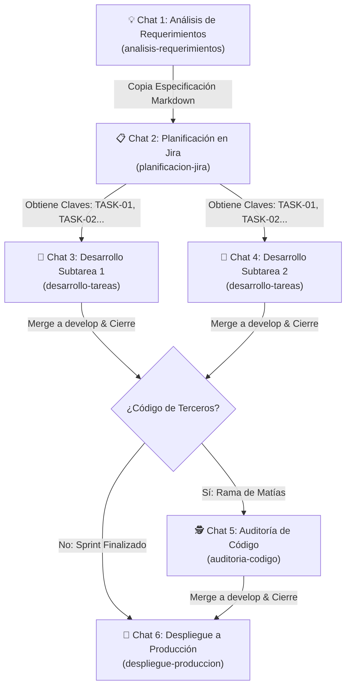

# 🧭 Playbook de Sesiones Aisladas & Catálogo de Prompts (UniTask)

> **Paradigma Operativo**: **1 Chat = 1 Tarea / Propósito Específico**.  
> El aislamiento de sesiones previene la degradación del razonamiento (*context poisoning*), elimina la latencia por saturación de contexto y garantiza que cada intervención del agente cuente con la máxima precisión y apego a las reglas.

---

## 🗺️ Mapa de Flujo y Protocolo de Transición (*Handoff*)

El ciclo de ingeniería en `UniTask` opera como una tubería modular donde el producto de una sesión alimenta de forma limpia a la siguiente:



### 🧬 Reglas de Oro de Higiene de Contexto

1. **Sesión de Propósito Único**: NUNCA desarrolles dos tareas en el mismo chat ni mezcles una auditoría con desarrollo.
2. **Cierre Inmediato**: En cuanto el agente confirme la fusión de la PR en `develop` y la eliminación de la rama local y remota, **archiva o cierra el chat**. Su ciclo de vida ha terminado.
3. **Reinicio Seguro ante Fricción**: Si una sesión acumula demasiados errores de prueba o se desvía, no intentes "reparar la memoria" del chat. Verifica el estado en Git (`git status`), abre un **Chat Nuevo**, usa la plantilla correspondiente e indica en el bloque de notas el punto exacto donde se encuentra la tarea.

---

## 📇 Catálogo de Prompts por Metodología

---

### 1. 💡 Análisis y Maduración de Requerimientos

* **Skill**: `analisis-requerimientos`
* **Regla**: `6_analisis_requerimientos.md`
* **Rol del Agente**: Technical Product Owner & Business Analyst.
* **Comportamiento**: Investiga la base de datos viva con Laravel Boost (`database-schema`, `database-query`), hace 2-4 preguntas breves y genera la especificación estructurada en Markdown. **Prohibido tocar código, Git o Jira API**.
* **Cuándo abrir este chat**: Cuando tengas una idea, inquietud de negocio o audio transcripto que aún no está aterrizado técnicamente.

#### 📋 Plantilla Copiable

```markdown
Modo Análisis de Requerimientos

Quiero analizar y madurar una nueva funcionalidad para UniTask antes de planificarla en Jira.

- **Idea o Requerimiento en Bruto**: 
  [Describe la idea, problema que resuelve o pega la transcripción del requerimiento aquí]

- **Usuario / Rol Objetivo**: [Ej. Alumno universitario / Administrador de Carrera / Docente]

- **Detalles o Restricciones Iniciales**: [Ej. Debe ser accesible desde el dashboard principal, no debe romper el cálculo de materias correlativas, etc.]

Por favor inspecciona la base de datos y modelos existentes con Laravel Boost MCP, formúlame las preguntas clave de negocio que detectes y genera la especificación final en el formato oficial listo para Jira.
```

---

### 2. 📋 Planificación y Creación de Tareas en Jira Cloud

* **Skill**: `planificacion-jira`
* **Regla**: `3_creacion_jira.md`
* **Rol del Agente**: Scrum Master & Tech Lead.
* **Comportamiento**: Ejecuta `/grill-me` si hay dudas, presenta el borrador estructurado (Historia de Usuario + Subtareas con Heroicons SVG y Story Points), espera tu "OK" y crea las incidencias vía API REST v3 de Jira (`.env.jira`).
* **Cuándo abrir este chat**: Inmediatamente después de obtener la especificación del Chat de Análisis (o cuando ya tengas los requerimientos claros).

#### 📋 Plantilla Copiable

```markdown
Modo Creación de Tareas /grill-me

Vamos a planificar y crear en Jira Cloud la siguiente funcionalidad para UniTask:

- **Especificación del Requerimiento**:
  [Pega aquí el bloque Markdown generado en el Chat de Análisis o el detalle de la funcionalidad]

- **Épica Padre**: [Ej. UT-10 Gestor de Materias y Correlativas / Dejar que el agente sugiera una existente]
- **Sprint Objetivo**: [Ej. Sprint 4 / Backlog general]

Por favor analiza el alcance, define la Historia de Usuario y desglósala en Subtareas técnicas (especificando criterios, Story Points y archivos afectados). Espera mi aprobación formal antes de llamar a la API de Jira Cloud.
```

---

### 3. 🚀 Desarrollo e Implementación de Tarea (Core)

* **Skill**: `desarrollo-tareas`
* **Regla**: `1_desarrollo_tareas.md`
* **Rol del Agente**: Senior Full-Stack Engineer (Laravel 11, Livewire 3, Tailwind, Pest).
* **Comportamiento**:
  1. Detecta Modo de Trabajo (Local vs. Remoto).
  2. Consulta la API de Jira y redacta el Plan Técnico. Espera tu "OK".
  3. Ejecuta `./vendor/bin/sail artisan jira:create-branch <CLAVE>`.
  4. Codifica bajo TDD (Pest), respetando estándar de Heroicons SVG (sin emojis).
  5. Realiza smoke test técnico en navegador con Playwright y Laravel Boost (`browser-logs` y `last-error` limpios).
  6. Entrega Guía de QA Manual (en Local apunta a `localhost:80`; en Remoto compila con `sail npm run build` y levanta `./scripts/tunnel.sh start`).
  7. Pausa obligatoria hasta tu "OK". Ciclo iterativo ante observaciones.
  8. Actualiza changelog, commit en español (SOLO clave de TASK, nunca HU), PR, merge en `develop` y borrado de ramas.
* **Cuándo abrir este chat**: **1 chat exclusivo para cada Subtarea (`TASK-xxx` o `UT-xxx`)**.

#### 📋 Plantilla Copiable

```markdown
Modo Desarrollo Tarea

Vamos a desarrollar la siguiente tarea técnica:

- **Clave de la Tarea en Jira**: [Ej. UT-205 o TASK-114]
- **Modo de Trabajo**: [Modo Local (en la PC) | Modo Remoto (desde el celular)]
- **Notas o Indicaciones Especiales**: [Opcional: Ej. Tener especial cuidado con la foreign key de materias, o Reutilizar el modal de confirmación existente]

Por favor consulta la tarea en Jira Cloud, inspecciona el esquema de base de datos necesario y preséntame el Plan Técnico detallado. Detén la ejecución y espera mi aprobación antes de crear la rama o codificar.
```

---

### 4. 🕵️ Auditoría y Revisión de Código de Compañeros

* **Skill**: `auditoria-codigo`
* **Regla**: `2_auditoria_codigo.md`
* **Rol del Agente**: Lead Code Reviewer & QA Architect.
* **Comportamiento**:
  1. Detecta Modo de Validación (Local vs. Remoto).
  2. Hace checkout a la rama remota del compañero (Matías Nuñez).
  3. Evalúa `git diff develop..HEAD`, consultas SQL (N+1), esquema Boost, calidad UI (Heroicons SVG) y suite Pest (100% verde).
  4. Estrategia Híbrida: Caso A (resuelve ajustes menores/tests faltantes directamente) vs. Caso B (rechazo justificado en Jira).
  5. Pre-verificación técnica en navegador (Playwright, `browser-logs`, `last-error`).
  6. Entrega Informe de Auditoría y Guía de QA para tu validación manual.
  7. Tras tu OK definitivo: apaga el túnel (si estaba activo), comitea/pushea, fusiona la PR en `develop` y **elimina la rama basura local y remota**.
* **Cuándo abrir este chat**: Cuando Matías Nuñez solicite revisión de su PR o tarea completada.

#### 📋 Plantilla Copiable

```markdown
Modo Auditoría

Vamos a auditar y revisar la entrega del siguiente trabajo:

- **Clave de Tarea en Jira**: [Ej. TASK-05 o UT-180]
- **Rama Remota o Autor**: [Ej. UT-180-TASK-05-nombre-rama / Autor: Matías Nuñez]
- **Modo de Validación**: [Modo Local (en la PC) | Modo Remoto (desde el celular)]
- **Puntos de Enfoque Específicos**: [Opcional: Ej. Verificar rendimiento de la query en la tabla de calificaciones y consistencia visual]

Por favor haz fetch de las referencias remotas, ubícate en la rama correspondiente, inspecciona el diff contra develop y corre la suite de pruebas. Presenta el Informe Técnico y la Guía de QA antes de cualquier acción en Git.
```

---

### 5. 🚀 Protocolo Seguro de Despliegue a Producción

* **Skill**: `despliegue-produccion`
* **Regla**: `4_despliegue_produccion.md`
* **Rol del Agente**: Release Manager & DevOps Specialist.
* **Comportamiento**:
  1. Verifica estado sincronizado y limpio de `develop`.
  2. Ejecuta suite global de tests (100% verde).
  3. Ejecuta guardia anti-destructiva (`migrate:fresh|db:wipe`).
  4. Revisa `.env.production.pending` y ofrece backup local de base de datos.
  5. Genera la Pull Request `develop ➔ main` con detalle técnico de migraciones y variables.
  6. Fusiona automáticamente la PR disparando GitHub Actions (`deploy.yml`).
  7. Monitorea el pipeline de CI/CD (Build + FTPS + SSH Post-Deploy en Hostinger) y ejecuta smoke test HTTP 200.
* **Cuándo abrir este chat**: Al cierre de un Sprint o cuando `develop` esté listo para publicarse en el entorno productivo de Hostinger.

#### 📋 Plantilla Copiable

```markdown
Modo Deploy

Vamos a desplegar a producción la versión acumulada en develop hacia main:

- **Versión o Etiqueta de Release**: [Ej. Release v1.4.0 - Sprint 3]
- **Resumen General de Entregas**: [Ej. Incluye módulo de correlativas, auditoría de tareas y mejoras en interfaz de usuario]
- **Variables de Entorno Nuevas**: [Indicar si hay nuevas claves en .env o "Ninguna / Revisar .env.production.pending"]

Por favor inicia las verificaciones pre-deploy obligatorias (suite completa de tests, guardia anti-destructiva y estado de Git) y guíame en el procedimiento seguro de release.
```

---

### 6. 🛠️ Edición y Evolución de Metodologías Personales

* **Skill**: `edicion-metodologias`
* **Regla**: `5_edicion_metodologias.md`
* **Rol del Agente**: Systems Architect & Prompt Engineer.
* **Comportamiento**:
  1. Diagnostica la necesidad de ajuste en las metodologías de `.agents/`.
  2. Analiza impacto cruzado en otras reglas y skills.
  3. Presenta cuadro comparativo "Antes vs. Después".
  4. Pausa obligatoria hasta tu "OK".
  5. Aplica los cambios de forma atómica y sincronizada en `.agents/rules/<N>_<nombre>.md` y `.agents/skills/<nombre>/SKILL.md`.
  6. Respeta `.gitignore` (**Prohibido hacer commits de `.agents/`**).
* **Cuándo abrir este chat**: Cuando detectes fricción, quieras optimizar un paso operativo, endurecer una regla o añadir una nueva herramienta al equipo.

#### 📋 Plantilla Copiable

```markdown
Modo Edición de Metodologías

Necesito ajustar y evolucionar una de nuestras metodologías internas de trabajo:

- **Metodología Objetivo**: [Ej. desarrollo-tareas | auditoria-codigo | planificacion-jira | despliegue-produccion | analisis-requerimientos]
- **Motivo o Fricción Detectada**: [Describe qué paso está generando demoras, qué herramienta nueva quieres integrar o qué directiva requiere mayor rigidez]
- **Comportamiento Deseado**: [Describe exactamente cómo debería operar el agente a partir de ahora]

Por favor evalúa el impacto cruzado en las demás metodologías y preséntame la propuesta técnica comparativa (Antes vs. Después) para la Regla y el Skill correspondientes. No modifiques ningún archivo hasta mi aprobación formal.
```

---

## ⚡ Guía Rápida de Selección de Modo (Local vs. Remoto)

Para las metodologías de **Desarrollo (`desarrollo-tareas`)** y **Auditoría (`auditoria-codigo`)**, el comportamiento del agente se bifurca según tu entorno físico:

| Criterio | 🖥️ Modo Local (`en la PC`) | 📱 Modo Remoto (`desde el celular`) |
| :--- | :--- | :--- |
| **Compilación de Assets** | No compila innecesariamente (utiliza el dev server de Vite si está encendido). | Compila assets obligatoriamente con `./vendor/bin/sail npm run build` para funcionamiento autónomo en smartphones. |
| **Acceso para Pruebas** | Provee URLs directas a `http://localhost:80` o `http://localhost`. | Inicia `./scripts/tunnel.sh start` y provee la URL segura temporal `https://*.trycloudflare.com`. |
| **Persistencia del Entorno** | Inmediata en el navegador de tu computadora. | Mantiene el túnel activo durante todo el ciclo de QA y revisiones. Lo apaga automáticamente con `./scripts/tunnel.sh stop` tras tu OK final. |
| **Alternancia Dinámica** | Si dices *"activa el túnel"* o *"lo pruebo en el celular"*, conmuta a Remoto al instante. | Si dices *"apaga el túnel, sigo en local"*, apaga el túnel y continúa en Local. |
